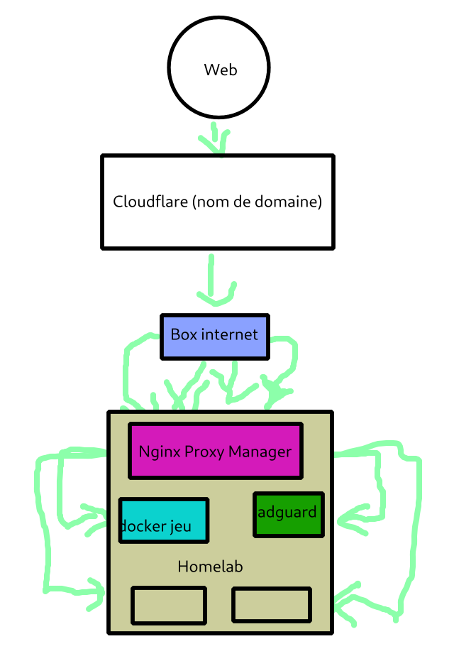
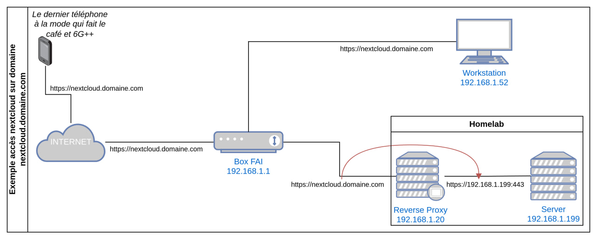

+++
title = 'Comment faire un serveur NAS sous Linux ?'
date = 2024-04-10
author = 'Darkone Linux'
+++

> Source : #help "Création serveur NAS, multimédia etc.", by BurningKitty

Quelques notes intéressantes à trier / résumer.

# Fez — 01/03/2024 22:13

Concernant l'OS, ce n'est pas le choix le plus important, dans tous les cas tu retomberas sur tes pieds. 
Tu as plusieurs possibilités, dans tous les cas, n'utilises pas de rolling release. Un serveur tu veux qu'il soit stable, la disponibilité des paquets n'est pas une priorité. T'as tous sauf envie de passer ton dimanche soir a réinstaller ton système et tes configurations. 

Tu as (mon avis) trois options : (Je ne liste pas toutes les distributions existantes, ce sont des exemples)

- Des distributions "typés serveurs" (distribution qui reste stable en raison de leur faible fréquence de mises à jours) : Debian (par exemple)
- Distributions immuable : NixOS  (il y a une courbe d'apprentissage mais le système est solide, t'as un fichier de configuration qui contient l'état du système. Tu peux l'ajouter a un nouveau système vierge, nixos le mettra dans l'état inscris dans la configuration)
- Distribution AIO : Unraid, OpenMediaVault, TrueNAS...  L'avantage est que tu disposes d'une interface graphique intégré accessible. Mais ça reste une bête distribution linux.

Si je devais faire un classement (meilleur a gauche, "moins bon" a droite) : NixOS == Debian == Unraid == OpenMediaVault > Proxmox > Truenas > ... > Arch, Gentoo...

NixOS est je pense le plus confortable une fois configuré mais c'est aussi le plus pénible a apprendre.
Comme je l'ai mentionné, tu as un fichier de configuration dans lequel tu décris l'état du système (ce que tu souhaites installer, comment configurer X, Y...) et ensuite tu tapes la commande et NixOS travaille pour toi et installe comme tu lui a demandé. 
Debian est un très bon choix également, une fois que tu l'as installé et peaufiné, tu fais une update tous les ans et tu n'y touches plus.
Dans le cas de NixOS comme de Debian, a moins que tu ajoutes une interface web dédié (copilot je crois ? ou encore portainer...) tu n'as pas de système de gestion de docker graphique intégré. C'est la méthode MacGyver mais c'est je pense la plus pratique une fois que tu maitrises docker compose, etc... 
Autrement dit, c'est l'approche minimaliste, celle où tu apprendras le plus. 

Unraid & OpenMediaVault sont super, j'ai un petit point faible pour Unraid (malheureusement payant) qui inclus des fonctionnalités similaire a MergerFS et SnapRAID, tu sembles connaître la chaine de Wolfgang, je ne t'apprends rien.
C'est vraiment dans les deux cas très appropriés pour les débutants, les confirmés... Tu profites d'une large communautés, la plupart des efforts ont été réalisés par des gens en amont, tu n'as plus qu'a installer et configurer tes logiciels.
Proxmox est très populaire, je m'en suis servi durant deux ans, c'est efficace. C'est selon moi l'entre deux parfait.
Tu as une interface graphique a peu près clean, tu peux manipuler tes vm et tes containers (LXC et pas docker). 

Truenas, j'ai une aversion contre cet os. C'est au départ une très bonne solution pour stocker tes données, je l'ai trouvé particulièrement pénible a configurer. Les updates majeurs m'ont parfois donné l'impression d'être fait n'importe comment. Tu te retrouves avec des logiciels a moitié mort du jour au lendemain.
Bref pour gérer tes données c'est génial, t'as du ZFS... mais pour gérer des dockers, etc... bof. 

Pour résumer, mon avis n'a aucune valeur, ce ne sont que des préférences, toutes ces distributions sont cool. 
Si dans cinq minutes je devais installer un homelab, j'utiliserais NixOS, Unraid ou Proxmox. 
NixOS pour le côté immuable + configuration déclarative (j'ai des années de terminal derrière moi, j'apprécie de pouvoir tout renseigner dans un fichier de configuration qui sera interprété de la même façon dans 6 mois par nix). On parle d'une configuration full ssh, terminal...
Unraid pour l'interface chaleureuse. Quand tu accèdes a la page web, tu te sens en sécurité. Tu cliques sur trois boutons et ton machine s'installe.
En plus, c'est un os installé sur une usb.
Au pire Proxmox.
Concernant la gestion de tes vm et docker. 

Maximise docker. 
Tu as un outil merveilleux qui s'appelle "docker compose", c'est quelque chose qui te permet d'indiquer comment gérer les containers docker. 
T'as juste a écrire le fichier (ou prendre celui proposé sur le site du logiciel) et tu tapes "docker compose up -d" et tu n'y touches plus. 

Pensée aléatoire : Pour éviter que tes disques se réveille toutes les cinq minutes et consommes de l'électricité pour pas grand chose, tu voudras probablement disposer d'un cache qui contiendra les données les plus fréquemment utilisés. 
Je m'explique. Lorsque tu feras tourner l'un de tes containers, tes logiciels devront écrire ou lire des données. 
Ces actions "réveilleront" tes disques et augmenterons la consommation électrique. 

Pour éviter de faire des appels de courant inutiles toutes les cinq minutes, écrire les données sur un disque de cache est une solution. 
Lorsque ton cache est plein, les données bascules vers tes disques.
Commence simplement. Je vois que tu as envie d'utiliser du graphana & co, c'est une bonne idée, commence petit et simple, ne t'embête pas avec kubernetes, graphana dès le début. Choisis un système pour commencer, mets en place tes containers avec docker compose, développe une solution de sauvegarde (3-2-1) qui fonctionne tout en essayant de restaurer le système (toujours essayer les sauvegardes !). Ensuite une fois que tu auras maîtrisé cet ensemble, commence a rajouter de nouvelles fondation.

J'ai aussi fait la "bêtise" de vouloir faire un homelab hyper bien fichu, optimisé blabla... Au final tu te retrouves avec un étron fumant imbitable a maintenir. Et après plusieurs mois tu n'oses même plus le toucher par peur de le foutre en l'air. 
Donc fais des essaies, déploiements... une fois que t'as une idée de comment tout s'articule, tu rajoutes des briques. 

Nextcloud AIO -> Docker (pense a rajouter "clamav" pour l'analyse des fichiers, si tu partages des fichiers avec d'autres personnes, tu n'as pas envie de te retrouver avec un virus)
Serveur de jeu -> VM ou docker (si tu peux passer par docker -> docker)
Serveur de messagerie ? Tu parles de matrix, """"discord"""" (alternative), mail ?

Pour tes mails je ne saurais pas dire. 
Sache cependant que la plupart des logiciels intègre les protocoles nécessaire pour se connecter a un mail (gmail, outlook...). 
Par exemple avec Bitwarden, je reçois une alerte par mail lorsqu'un compte s'est connecté depuis une ip inhabituel. 

Pour le partage de fichiers : NextCloud est une solution. Pense a Smb également qui est solide. 

T'as pensé au reverse proxy ? Nginx, nginxproxymanager, traefik... ? 

--- 

Si je résume : 

L'os : choisis selon tes préférences, ça n'a pas d'importance. 
VM ou docker ? Docker 99% du temps tu veux passer par docker. 
Les vm monopolises une partie des ressources, docker les partages. 
Utiliser une vm ça implique de devoir configurer X fois une debian... 
Utiliser un docker, tu configures uniquement le logiciel que tu déploies.
Reste simple, te casse pas la tête avec kubernetes ou graphana dès le départ. 
Commence simple, reste simple. Les optimisations c'est une fois que tu as de l'expérience que tu y réfléchis pas avant d'avoir installé. 

Si tu étais réellement obligé de passer par une vm. Utilises qemu. Tu me remercieras. (libvirt si tu as besoin d'une interface)

Prévois une solution de sauvegarde. Pas uniquement des données clonées sur deux disques d'un même système. 
On parle d'un disque "hors site" (ou a la rigueur extérieur a ton homelab). 
Teste tes sauvegardes et restauration, établi un petit protocole pour t'éviter des sueurs froides. 

Pense a choisir un reverse proxy, le truc qui te permettra de diriger les connexions vers tes programmes.
Pense au nom de domaine. Si tu as une ip fixe (box internet) tu devrais pouvoir t'en passer. Si tu es en dynamique (c'est certain) tu auras besoin de passer un domaine type cloudflare. 

Renseigne toi sur les VPN (wireguard, tailscale) pour te connecter de l'extérieur a ton réseau local en toute sécurité.

# Fez — 03/03/2024 18:10

Pour réduire les potentiels attaque sur ton serveur, tu as la possibilité d'utiliser cloudflare pour gérer ton nom de domaine. Il dispose d'options pour empêcher des ip spécifique (en filtrant par pays) de se connecter. 
Tu fais attention a ne laisser que le minimum vital de port ouverts, change ton port ssh (différent du port 22 donc), tu utilises quelque chose comme fail2ban pour blacklist les ip qui tente la connexion et échouent. 
Ou tu utilises un vpn maison pour te connecter a ton ssh de sorte a être le seul a pouvoir le faire. 

Vu sous cet angle, utiliser une machine virtuelle contenant tes docker peut être pertinent pour isoler les services de ton réseau local. 

Cool pour ton tache. Je sais que sur unraid, il y avait un plugin qui avait été développé pour automatiquement déplacer vers le cache les données que tu visitais le plus, mais je ne sais pas si snapraid ou merger le gère. 

Une solution 3-2-1 ça signifie : 

3 sauvegardes (total)
Dont 2 chez toi (1 qui est dans ta machine en fonctionnement, ton homelab en l'occurence, 1 en dehors de ton homelab, comme un hdd externe)
Et 1 hors-site donc hors de chez toi. 

ça semble être excessif au premier abord mais ton homelab tombera en panne au mauvais moment. Et tu as tous sauf envie de devoir te retaper des configurations de zéro qui date d'il y a des années. 
Tu peux dans un premier temps te passer du hors-site, mais garde ça dans un coin de ta tête. 
Tu as un très bon logiciel "borg backup" pour faire tes sauvegardes (c'est une sorte de dépôt git que tu crées sur un disque quelquonque ou une machine distante et tu choisis les données a sauvegarder. Il existe un système de déduplication ce qui allège tes sauvegardes. AdrienLinuxtricks a en parlé dans une vidéo il me semble. 

Tu as aussi Duplicati comme Grum le mentionne, je m'en suis servi c'est très bien.
Encore une fois prends ce qui te semble le mieux, fais une sauvegarde de test et tente la restauration pour t'assurer que ça fonctionne.

J'ai fais un schéma a l'arrache qui représente le "traffic" d'une connexion lorsque tu as un nom de domaine + reverse proxy.
Dans le principe, quelqu'un depuis son url essaie de se connecter a un domaine ou sous-domaine qui t'appartiens.

# ayo — 04/03/2024 13:30

A mon tour d'ajouter mon petit grain de sel ... Je suis assez d'accord avec les différentes reccos (hormis cloudflare... qui devient trop "central").

COTE MATOS

attention aux HDD d'occasion, et surtout envoyés par colis, c'est fragile ces petites bêtes. Bon après tu fais du RAID donc tu minimises le risque. Mais il serait bon quand même de bien faire attention à cette partie cruciale quand tu fais du stockage.
Un bon investissement dans des HDD de qualité est parfois mieux que quelques euros grappillés par ci par là, et peut te sauver du temps plus tard !

400W pour tout le matos, surtout les HDD SATA...
As tu bien creusé ce point ?
+ le point de la chauffe ?

pour le reste du matos, c'est OK si tu restes sur qqch de très simple ; MAIS grosses questions sur les 32GB RAM et les 4 vCPU : si tu commences à virtualiser, ça risque peut être de poser souci si tu montes x containers + x VMs ... Ca va vite quand on fait de la virtualisation (Par ex. une instance nextcloud tu vas vite voir que lui allouer 1vCPU ça peut être juste...)

COTE LOGICIEL

OPNSense / PFsense font office d'OS pour routeur/FW, pas pour gérer du NAS ou des VM.... plutôt pour sécuriser les entrées/sorties réseau.
Mais je rejoins darkone pour parler de ce point qui est trop souvent mis de côté : il est bon, quand on ouvre le côté entrant, de comprendre un minimum comment on sécurise convenablement son réseau (les accès, les rôles, etc...).
Obligé d'y passer donc (et l'histoire du reverse proxy en fait partie) @BurningKitty  😉 

pour ton serveur de messagerie... On ne sait pas de quelle messagerie il s'agit ?!
Si email, attention au port 25 sortant qui est toujours bloqué chez les FAI.
enfin, attention également, chez certains (de plus en plus) FAI, ton IP publique est dynamique : ce qui veut dire qu'elle peut changer à tout moment !! Chez certains autres FAI, il me semble que l'IP est même partagée (c'est plus rare cela dit) : c'est à dire que tu as une plage de ports (réseau) qui t'est allouée...

Solutions :

Il me semble que chez free tu peux demander une IPV4 full stack, plus de souci de ce côté.
Pour Orange c'est uniquement les PRO qui ont des IP statiques, mais l'IP dynamique change peu rarement (à vérifier cela dit!), mais elle change quand-même
Et je ne connais pas les autres fai, il faut se renseigner
Donc, hormis free et son IP full stack, obligé de passer par du DNS dynamique, ce qui rajoute un poil de complexité (rien de bien méchant mais il faut en être conscient).
Point à creuser donc.

Il y a tellement de petits points qui peuvent bloquer que c'est difficile de tout énumérer
Le plus important : KISS 😉

Je te glisse un schéma de principe sur le reverse proxy, si jamais, exemple avec un nextcloud
(Les IPs et domaines sont totalement fictifs, bien entendu !) 

# Fez — 06/03/2024 09:28

J'ai un total de trois nuc (j'appel ça un nuc pour que l'on se comprenne, c'est un abus de langage) en guise de homelab :

- 2x NUC N100 (Beelink Mini S12 Pro)
- 1x NUC 5095 (GEEKOM NUC Mini PC, MiniAir11)

Les deux N100 ont le même rôle mais sont dédiés a deux utilisateurs différents. 
Le 5095 contient les services "vitaux" du homelab. 

5095 :

- adguard
- bookstack
- cloudflare-ddns
- esphome
- homeassistant
- frigate
- zigbee2mqtt
- homebox
- immich
- it-tools
- kiwix
- nextcloud
- nginx proxy manager
- pairdrop
- paperless
- syncthing
- vaultwarden

frigate, immich, nextcloud sont les services les plus lourds. (Pour info, par le passé ces services tournaient sur le N100, je les ai déplacés pour avoir les services vitaux sur un appareil dédié) 

N100 : 

- gitea (un github auto hébergé)
- freshrss
- kavita
- metube
- ollama-webui
- penpot
- sonarr, radarr, ...,  jellyfin, jellyseer.
- snippet-box
- tdarr
- tubearchivist

Tout ces services fonctionne sur un seul N100 sans ralentissement majeur, il faut simplement noter qu'il faut utiliser un maximum l'igpu lorsque c'est possible.

# ayo — 06/03/2024 10:06

Outils de "productivité" :

- vikunja
- logseq
- omnivore
- anytype.io

# Darkone — 06/03/2024 11:11

Alternatives : 

- TiddlyWiki : moche mais efficace
- Taskwarrior : très complet en ligne de commandes
- Obsidian + git local

# Autres infos

- Darkone : pour les marins : serveur SignalK + Node-Red, vraiment top pour automatiser et monitorer avec prometheus + grafana.
- Xav : On m'a donc conseillé AlmaLinux, fier descendent de CentOs 7, donc une jolie base RHEL faite principalement pour de l'usage serveur. En plus, t'as pas mal d'option de configuration par défaut, si tu préfère un OS vide, ou bien un OS avec un DE, une interface web (copilot), etc, etc...
- Fez : C'est l'inconvénient de n'importe quel OS NAS, OMV, Proxmox, Unraid etc... tôt ou tard, tu finiras par devoir passer par le terminal. C'est pour ça que je suis passé à du 100% terminal. Tu finis par créer de petit script pour gérer l'entretien et tu t'y retrouves. 
